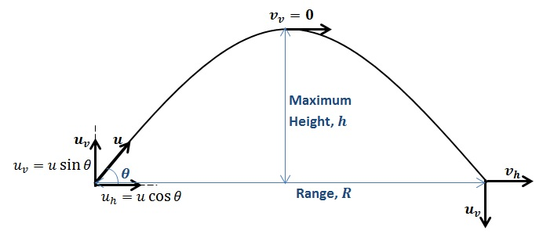

# Projectile Motion

## Description

This notebook simulates projectile motion for two launch angles ($\theta_1 = 45^\circ$ and $\theta_2 = 30^\circ$) with an initial velocity of $u_0 = 40 \, \text{m/s}$ under gravity $g = 9.81 \, \text{m/s}^2$. It computes horizontal and vertical position over time and plots the trajectory for each angle.

Drag is neglected — this is the idealised vacuum case.



## Practical uses

- **Trajectory analysis** — predict a projectile's path for a given launch angle and velocity.
- **Optimization** — find the angle that maximises range or height (ballistics, sports equipment).
- **Education** — visualise how launch angle alone changes the trajectory.

## Key equations

Velocity components:

$$u_x = u_0 \cos(\theta), \qquad u_y = u_0 \sin(\theta)$$

Position over time:

$$s_x = u_x t, \qquad s_y = u_y t - \frac{1}{2} g t^2$$

Total flight time:

$$t_{total} = \frac{2 u_y}{g}$$

## Running it

From the repository root:

```bash
pip install -r requirements.txt
jupyter lab "Mechanical Engineering/Notebooks/Machine Design/Projectile Motion/Projectile Motion.ipynb"
```
